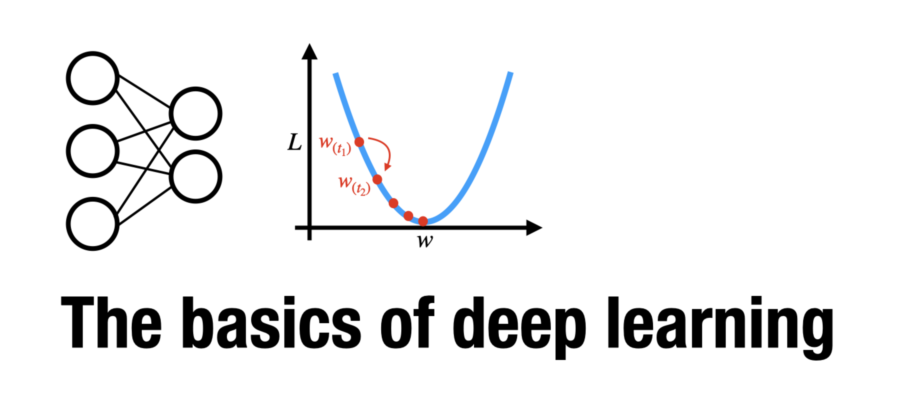

# An introduction to the basics of deep learning



This repository contains a reproducible course on the basics of deep learning.

Each topic is covered in a separate [Jupyter notebook](https://jupyter.org); each containing a theoretical introduction to its topic as well as a practical exercise.


## 1. Running the notebooks

For a general introduction to the Jupyter environment, I recommend [this tutorial](https://www.dataquest.io/blog/jupyter-notebook-tutorial/).

You can either install all required dependencies for the notebooks locally (see below) or run the Jupyter notebooks on  [Jupyter Binder](https://mybinder.org) using the following link:  https://mybinder.org/v2/gh/athms/deep-learning-basics/HEAD

[](https://mybinder.org/v2/gh/athms/deep-learning-basics/HEAD)


## 2. Local installation

**1. Clone and switch to this repository:**

```bash
git clone https://github.com/athms/deep-learning-basics.git
cd deep-learning-basics
```

**2. Install all dependencies** listed in [`requirements.txt`](requirements.txt). 

I recommend setting up a new Python environment (e.g., with the [miniconda installer](https://docs.conda.io/en/latest/miniconda.html)). 

You can create a new [conda environment](https://docs.conda.io/projects/conda/en/latest/user-guide/tasks/manage-environments.html) using the following command:

```bash
conda create --name deep-learning-basics python==3.8
```

This will create a Python 3.8 environment with the name `deep-learning-basics` .

You can activate the new environment as follows:

```bash
conda activate deep-learning-basics
```

and then install all required dependencies in the environment: 

```bash
pip3 install -r requirements.txt
```

**3. Start the Jupyter notebook server:**

```bash
jupyter notebook
```

## 3. Course content

So far, this course covers the following topics:

- [`0. Perceptrons and gradient descent`](0-Perceptron-Gradient-Descent.ipynb)
- [`1. Neural networks and backpropagation`](1-Neural-Networks-Backpropagation.ipynb)
- [`2. Computer vision with convolutional neural networks`](2-Convolutional-Neural-Networks.ipynb)

I am hoping to expand on this over time, adding introductions to: 

- Recurrent neural networks
- Explainable artificial intelligence
- Deep reinforcement learning
- Supervised, unsupervised, and self-supervised deep learning


## 4. Workshop requests

If you enjoyed the contents of this course and would like to host a workshop at your university (or other institution), email me at: athms.research@gmail.com 